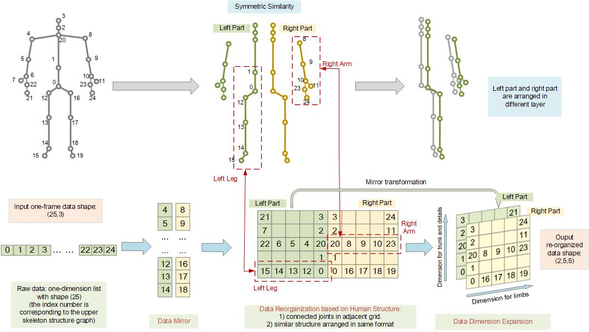
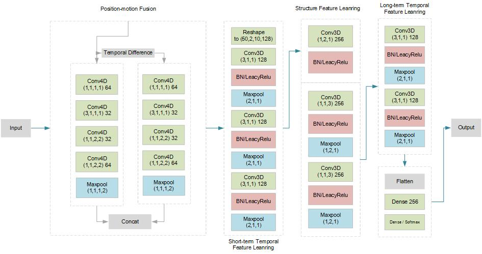

## Abstract

In recent years, human action recognition based on skeleton information has recently drawn increasing attentions with published of large-scale skeleton datasets. The most crucial factors for this task line in two aspects: the intra-frame representation for joint co-occurrences and the inter-frame representation for skeletons' temporal evoluations. The most effective ways focus on the spontaneous features extraction by using deep learning. As we know, these are not so many methods fully consider the structure information of skeleton joints and the correlation between two different skeleton joints for human action recognition. Most of the former works can not stress the human-aware relationships between some joints like symmetry and keep the free feature extraction abilities of deep learning networks at the same time. In this paper, we do not simply treat the joints position information as unordered points. Instead, we employ a special data reorganizing strategy to represent the global and local structure information of human skeleton. Meanwhile, we also employ the data mirror to increase the relationship between skeleton joints by fully consider the structure information of human. Based on this design, we proposed an end-to-end multi-dimentional CNN network to fully consider the spatial and temporal information to learn the feature extraction transform. Specifically, in this CNN network, we employ different convolution kernels on different dimensions to learn skeleton represent from spatial and temporal viewpoint in order to make the most of human structural information to generate robust features. We compare with other state-of-the-arts on action recognition dataset like NTU RGB+D, PKU-MMD SYSU and U-Kinect. The experimental results also demonstrate the superiority of our method. 

## keywords

Convolutional Neural Network, Deep learning, Human activity recognition, Human skeleton information

## OUR APPROACH

### Data Reorganization

Our approach includes two important parts: 1) the datareorganizing strategy; 2) the structure Relevance Feature
Learning Network. Thus, in this section, we will detail these two parts.

Many former works focus on the network structure designing instead of data organization method. A lot of correlation information get lost before fed into the deep learning model, which increase the difficulty of action recognition obviously. For instance, the position information of all the joints are arranged just like a list without explicitly order ( their network structure also make it impossible to make use of the order ) in HCN \cite{hcn}. In such a structure, all joints are treated samely without correlation relationship. Although graph based method is inherently able to represent the connection of different joints, current way is still a lack of perfect way to represent the structure of human and also improve the representation in training step.

Here, we propose a novel data reorganization method, which can effectively represent human structure and also save the structure and correlation information in model learning step. 
The data reorganization strategy of our approach can be divided into three parts, which are data mirror, data reorganization based on human structure and data dimension expansion. We will detail this three parts in the next subsections. 

#### Data Mirror

In our opinion, one of the most important structure features of human body is that it is of perfect symmetric property. The symmetric structure can be represented in many action, such as ``raise hand'', ``Run'', ``Jump``. These actions have obvious symmetric property. However, most previous work do not pay much attention on this property. Many work treat all the skeleton joints equally\cite{valstm}\cite{hcn}. Although some researcher did notice to represent the body structure based on graph structure \cite{stgcn}\cite{fdnet}, it is still hard for them to represent the symmetric information of human body in the graph structure. % TODO: 图的边表征方式单一
Based on this condition, we divided the skeleton joints into left part and right part like figure \ref{embedding}. This design can effectively consider the human body structure and save the global information of human action in data level. 

#### Data Reorganization based on Human Local Structure

In the step of data mirror, we consider the global information of human structure to divide the skeleton joints into left part and right part. Then, we need to consider the local information of human body to divide the skeleton joints into arm, thighs, shoulder, torso parts and so on. 

For example, dancing can be divided into specific movement of left leg and right hand. Meanwhile, we also consider the human symmetric information and the correlation information of human local structure to organize the skeleton joints. Like Figure.\ref{embedding}, we arranged the skeleton joints of the torso vertically. We arrange the skeletal joints of the limbs in a transverse fashion. Meanwhile, we also guarantee the mirror of local information. We fill in with zeros where there are no skeleton joints. This design can effectively save the human structure and also represent the local information of human body.

#### Data Dimension Expansion.

According to above steps, we have make the data mirror by considering the global information and also make the data organization by consider the local information. Based on this design, we have consider the correlation between the similar skeleton joints, such as arm or shoulder. However, this correlation do not be saved or represented in training step. The traditional convolution kernel do not operate on the two different location of the same dimension in one operation. In order to handle this problem, we make the data dimension expansion to converted the $N*2N$ data matrix into the $2*N*N$ data matrix. The similar skeleton joints appear superimposed. There are two reasons in this design: 1) the feature mining process of two body parts can be shared due to their similarity; 2) the correlation of symmetrical body parts can provide more information to improve the robust of final feature vector in training process. The detail of this operation is shown in Figure.\ref{embedding}.

### The Architecture of Network

In this section, we will detail the architecture of our network like the figure.\ref{network}. In recent years, many approaches has been proposed to utilize CNN model to handle action recognition problem. These methods also employ different filters to capture long-term features or short-term features in video sequence. However, the confuse data organization do not inflect the strength of CNN model. In this paper, based on the novel data organization, we design the novel architecture of network. We employ some special filters, which can extract the temporal and structure feature based on human skeleton joints. Meanwhile, the network also can find the correlation information between joints.  

In the next, we will split four parts to introduce the structure of network. 1) Position-motion fusion module; 2) Short-term Temporal Feature Learning; 3) Symmetric feature learning module; 4) Structure Feature Learning module; 5) Long-term Temporal Feature Learning.

#### Short-term Temporal Feature Learning.

Human action can be classified into short-term actions (local information) and long-term actions (Global information) generally. Long term actions can often be broke into small action modules. 
% 举例说明
For example, shaking hands can be decomposed into raising hands, getting close, touching hands and moving back. In image processing domain, complicated image pattern such as face can break into low-level features such as texture and margin and CNN provides a hierarchical way for feature learning of different level. 
% 所以用不同规模的卷积捕捉不同时间跨度的特征
Inspired by this, we also apply CNN based convolutional networks to model actions of different time scale. In this part, the reception field of these layers are small in the raw data in time dimension so that this part is concentrating on learning short-term action features of local joints. 
Here, we define the size of filter $(3,1,1)$ in this part like figure.\ref{}. The scale of temporal is set to $3$ and the scale of visual is set to $(1,1)$. The goal of this design is to focus on the temporal field and save more local information in this step. After these steps, we utilize the ``max pooling'' layers to compresse the data in temporal field. The goal of this design is used to save global information in the next steps.  

#### Structure feature learning module.

The most important structure features of human body lie on two aspects. 1) Symmetric structure: A lot of human actions are finished by symmetric parts of human body such as clipping hands, walking, etc. There is no doubt that we should pay special attention on the relationship of symmetric body modules. Human body structure is inherently symmetric and the interactions of symmetric parts are sometimes extremely important for action recognition. 2) Correlation structure: there are obvious similarities in limbs and they often play an important role in action recognition. The correlation information of these local joints should be consider in training step. Based on this information, we design two structures in this network to learning the symmetric structure and correlation information like figure.\ref{}. 

However, most of the former works in action recognition area do not pay special attention on symmetric characteristics of human actions. We think that the root reason lies on the inherent characteristics of deep learning model. Different from traditional hand-crafted method, deep learning strategy extracts features in an automatic way, which bring in free feature extraction ability but also makes it very hard to add prior knowledge into the model learning process.

In order to improve the robust of final human action feature and inflect the effectiveness of data organization, we define a set of different filters in this network. First, in order to save the symmetric structure, we utilize the $(1,2,1)$ filters to process the data matrix because we also have make the Data Dimension Expansion in data process step. 
Our model is especially powerful when representing these different kinds of relationships. We achieve this by putting different joints of different relationship in different dimension so that one dimension is corresponding to one kinds of relationship between joints. When this embedding strategy interacts with the features of convolutional neural networks, we get to use deep neural network to model features in a controllable way. More specifically, assuming the data shape is $(time,symmetry,limbs,strunk,3axis\_position)$, we can use a filter with shape of $(a_1,1,a2,a3,a4)$ to share parameters between symmetric parts and use one with shape of $(1,2,1,1,1)$ to model features of symmetric parts explicitly. The parameter sharing mechanism not only decrease the amount of parameters we use, but also make it easier for the model to achieve convergence.

In most cases, actions are finished by legs and arms, which means that limb movements are very informative for recognizing actions. In the preprocessing part, we stress that we rearrange the joints position and motion information under some principles to fully explore the spacial information of joints. Thus, we utilize the $(1,1,3)$ filter to save the local or trunk information in model training step. This filter can effectively focus on the spacial information of joints and zoom the application of local joints in training step. 

#### Long-term Temporal Feature Learning

Based on the above steps, the ``max pooling'' has compresses the data sequence. It means that the long-term information has been compressed into short-term data. Thus, we also utilize the $(3,1,1)$ filter to process the sequence data. Here, this module is also different from the former temporal feature learning part which mainly focuses on local joints. The same filters represent different useful in the network. Meanwhile, we utilize the two convolutional laysers and two max pooling layers. Each max pooling layer both can compresses the data in temporal dimension. It means that each convolutional layers save different scale temporal information. The deep convolutional layer save more global information in training step. 

[Download paper here](http://academicpages.github.io/files/paper1.pdf)

Recommended citation: Your Name, You. (2009). "Paper Title Number 1." <i>Journal 1</i>. 1(1).